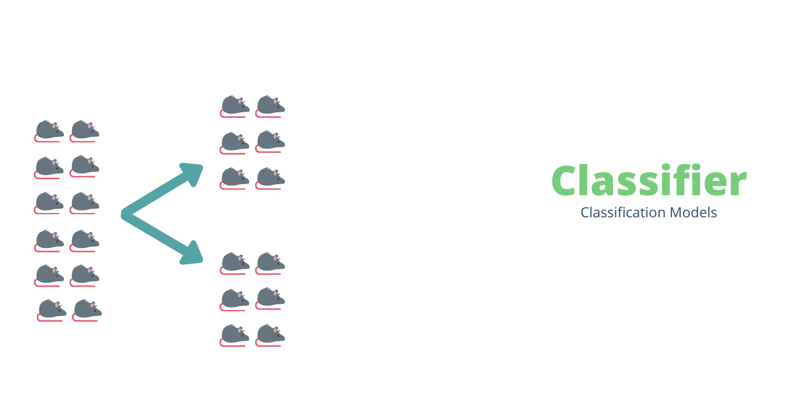

<h1 align='center'>Classifier</h1>

  

  

  

  

   

  
  
  
  
  
  

<h2 align="center">A collection of Regression models</h2> 

# Table of contents

- [Usage](#usage)
- [Installation](#installation)
    - [Install Editor(Visual Studio code,Sublime](#install-editor)
    - [Install Python 3](#install-python)
- [Contribute](#contribute)

# Usage

# Installation
- Python notebook is prefered.
- Anaconda / Mini conda / Packages used

### Install Editor

###  Install Python

# Contribute
Please check the [**Contributing Guidelines**](https://github.com/SandeepBalachandran/Predictor/blob/master/CONTRIBUTING.md) before contributing.

Please Add your suggestions to improve the models. Every thoughts are welcome.
